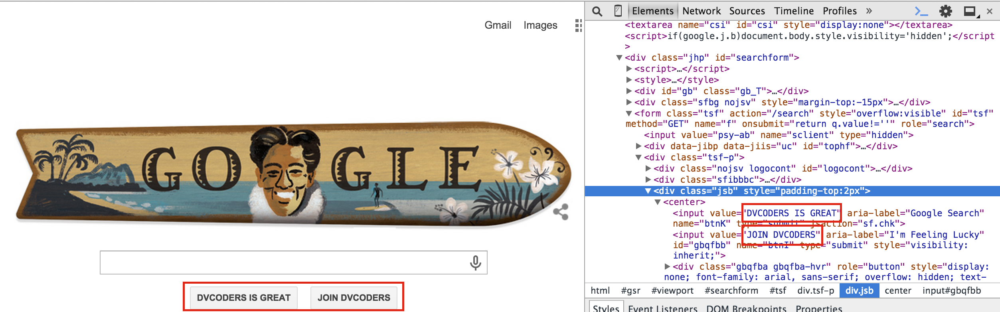
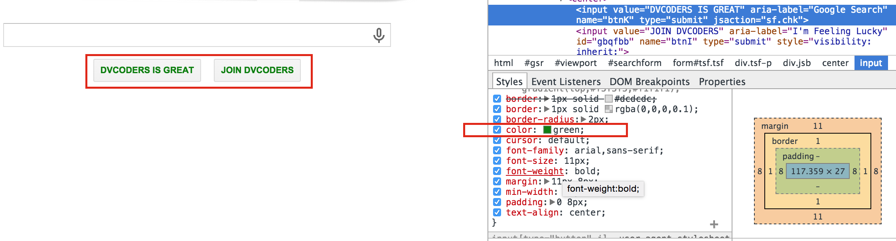
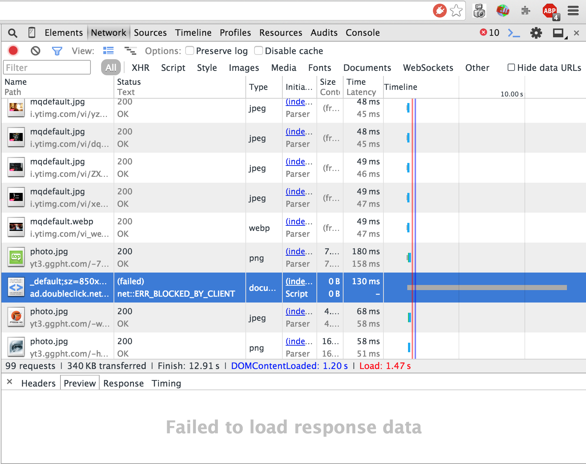
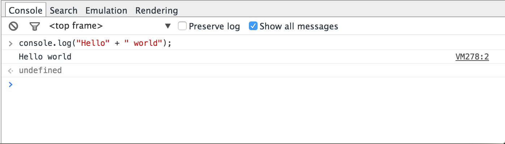

## Web Technology Guide

> The internet is NOT a ["series of tubes"](https://www.youtube.com/watch?v=f99PcP0aFNE)! 

This intro-web guide will broadly cover important concepts in how the web works, how people interact with it, and 
the tools used to create and maintain web pages, APIs, databases, etc.

### What is the internet?

The internet is simply a global connection of computer networks.

Your home network connects to a network in your city, which connect to a larger network in your region, then to other networks in the country, which connect to networks around the world.

Through these connections your computer has connection to other computers. 

Some of these computers are called "servers". Servers are the backbone of the internet, they store content and "serve" them to users around the world. Servers need to more powerful than the average computer in order to handle up hundreds or millions of requests.

### What is a "client"? What is a "server"?

- A "client" is what the user uses on their machine to request information from servers (websites really).

- A "server" is a computer which stores data in order server when someone requests it (web page, file, video, etc.)

The web browser you're using right now is the "client" on your computer which helps you request web pages like Youtube, Facebook, or Reddit.

The client can be thought of as a customer at a restaurant. They look a menu, decide what they want, and make a request to the waiter (server) who places that order. Some time later the waiter comes back with the meal. The waiter is able to create the meal through the kitchen; when the meal was done the waiter responded to the customer's request with a completed meal.

**Note**: The customer did not go into the kitchen to make their own meal. They trusted that waiter would fulfill their request.

This request/response model makes the basis for how the client and server interact, called *HTTP* (Hyper Text Transfer Protocol) which will be explained shortly.

### How is information broken down and sent?

To serve or send a web page, file, picture, or video directly would be very hard! These files can be very large and sending them would take ages!

Sending data requires **three** key things:

  1. Rules for "packaging" data - (breaking into tiny pieces)
  2. An interconnected network to send over - (ex.the internet)
  3. A way to "route" the data to the computer which needs to receive it — (IP Address)

### What is a packet?

A packet is a tiny piece of the original file which is being sent — (either from the client or to the client).

It's very efficient to break a large file into smaller bits, send them to the their destination computer, and have that computer reassemble them into the original file.

Packaging a file can be thought of as cutting a glass into pieces and sending them to a friend with instructions on how to erasable the vase. One, you've just saved a lot space in mailing the glass for your friend to drink with. Two, your friend does all the work reassembling it. Three, it was efficient to send because it was precisely cut and sent with specific instructions.

We've covered how the the internet is structured, but how does the computer sending the data know *where* it needs to go? That's where IP Addresses come in!

### What is an IP Address?

**192.235.5.154**

An IP address is a unique number assigned to computer while you're connected to a computer network.

It is assigned by following protocols, *TCP* and *IP*. This protocol is responsible for addressing, routing, and transferring information. You can read more about TCP/IP [here](http://www.thegeekstuff.com/2011/11/tcp-ip-fundamentals/).

That is an example of a IPv4 (32 bit) address, which was an early addresses protocol. There have been so many devices connecting to the internet, that IPv6 (128 bit) needed to be invented to accommodate new devices.

Just to put it into perspective, IPv4 can hold 4.2 x 10^9 unique addresses. IPv6 can hold 3.4 * 10^38 addresses!

### What are DNS servers?

When a user accesses a website like [https://twitter.com](https://twitter.com), the **Domain Name System** translates the human-readable url twitter.com into an IP Address by doing a **lookup**.

> The Domain Name System is maintained by a distributed database system, which uses the client–server model. The nodes of this database are the name servers. 

> Each domain has at least one authoritative DNS server that publishes information about that domain and the name servers of any domains subordinate to it. The top of the hierarchy is served by the root name servers, the servers to query when looking up (resolving) a TLD. 

[Source: [Wikipedia](https://en.wikipedia.org/wiki/Domain_Name_System#Name_servers)]

### What is HTML and how is it used?

HyperText Markup Language is a markup language used to add structure and content to webpages.

HTML is composed of a series of tags such as `<p>` (paragraph) and `<div>` (image) to indicate different types of content.

Your browser interprets the tags and uses them to display the content how it is specified.

HTML follows the Document Object Model (DOM) convention. The DOM is a "tree" or "hierarchy" composed of objects. HTML elements are objects in the tree. Tags such as `<p>` and `<div>` specify elements. The DOM is called a "tree" because elements can be "children" of an element, or "parents" of elements as well.


(Image courtesy of w3schools.com)

Play around with HTML by creating a file with the extension `.html` using any text editor. You can learn about the specific syntax and structure from [w3schools](http://www.w3schools.com/html/) or [devdocs](http://devdocs.io/html/) for quick reference.

For now, start off with an `.html` file with these elements:

```html
<!DOCTYPE html>
<html>
  <head> 
    <title>My Cool Site</title> <!-- This is displayed in the "tab" for your site on your browser -->
  </head>

  <body>
    <!-- The <h[NUMBER]> tag is for "headers" which means big bold text -->
    <h1>Big heading</h1> 
    <h2>Smaller heading</h2>
    <h3>Even smaller heading</h3>
    <h6>The smallest heading</h6>
    
    <!-- Paragraphs start with <p> tag, surprise! -->
    <p>This is a paragraph</p>
    
    <!-- you can include images too -->
     
    
    <!-- Line break -->
    <br> 
    <p> <b>Have fun!</b> play around with tags.</p>
  </body>
</html>
```

### What is CSS and how is it used?

CSS or *Cascading Style Sheets* is a language used to style the appearance and layout of a webpage (HTML).

To use CSS for your webpage, create a file with the extension `.css` in the same directory (folder) as your `html` file. Then "link" the CSS and HTML together by putting the following line in the `<head>` section of your `html` file:

```html
<head>
  <link rel="stylesheet" type="text/css" href="[FILENAME].css">
</head>
```

CSS uses "selectors" to refer to the portions of the document that you want to affect. The selector `p` refers to all paragraphs in your HTML.

After the selector are a number of declarations, which include properties and values. One such declaration might be `background-color: green`. Put it together with a selector like this:

```css
p {
  background-color:green;
  /* Include more declarations here */
}

/* Include more selectors here */
```

In this case, `background-color` is a property and `green` is a value.

Let's say you only want to affect *some* of the paragraphs in your html. What selector would you use? An easy solution is to use classes in your html. To do so, go back to your html document, and change the tag of the element you want to affect like so:

`<p class="red-paragraph">This is a paragraph</p>`

Now in your css, use the selector `.red-paragraph` to refer to any element with the class "red-paragraph". IDs are similar, except they can only be used for *one* element and the CSS selector uses a # instead of a period like so: `#id-name`. The html element for an ID looks like `<p id="id-name">`. Elements can even have multiple classes, just separate them with a space like so `<p class="class-1 class-2">`.

There is a lot to learn about CSS and [w3schools](http://learnxinyminutes.com/docs/css/) is a great reference. For now, you can play around with CSS by writing it in `style.css` and then adding `<link rel="stylesheet" type="text/css" href="style.css">` to your html `<head>` section. One example CSS file might look like this:

```css
html { /* The html selector refers to the entire document */
  /* This is a hex code referring to a color */
  background-color: #CCFFFF; 
}

h1 {
  text-align: center;
}

.small-headings { 
  /* Remember the <div class="small-headings"> tag from the html? */
  border-style: solid;
  border-width: 4px;
}

p {
  font-family: serif;
  font-style: italic;
}

.red-paragraph { 
  /* Remember to add the class red-paragraph to your <p> tag in order for this to have affect */
  color: red;
}
```

Notice that `red-paragraph` is in italics, because the declaration in `p` affects *ALL* paragraphs, even the ones with a class.

There's a lot of really cool stuff you can do with CSS now, but unfortunately not everything is supported by all browsers. Check out some cool stuff like [transitions](http://www.w3schools.com/css/css3_transitions.asp) and [animations](http://www.w3schools.com/css/css3_animations.asp).

### What is JavaScript?

Javascript is the language which allows you to add, find, update, and manipulate elements in HTML and CSS (along with many other awesome features). It is *essential* to the web, so we wrote **an entire `intro` guide** for it which you can [dvcoders/intro-javascript](https://github.com/dvcoders/intro-javascript).

  
### What is an HTTP request? How is it used?

Earlier we talked about [clients and servers](https://github.com/dvcoders/intro-web#what-is-a-client-what-is-a-server). Now, we're going to talk about a *protocol* which is simply a standard for enabling the connection, communication, and data transfer between two places on a network.

There are a few type of protocols which are used on the web: HTTP, HTTPS, FTP, and WebSockets. For the sake of convenience we are going to familiarize you with HTTP (the most common protocol between clients and servers).

HTTP stands for *Hyper Text Transfer Protocol*, which defines how web resources should be sent across the internet (HTML, PDF, Images, JSON, etc).

To double back to our restaurant example from earlier, there are **four primary actions** in an HTTP request which describe what interactions the client and server are able to have.

| METHOD | MEANING                                                                                                          | RESPONSE                                                                                                                                                                                                  |
|--------|------------------------------------------------------------------------------------------------------------------|-----------------------------------------------------------------------------------------------------------------------------------------------------------------------------------------------------------|
| GET    | **Request** some specific data from the server <br>Ex. "Could I have another spoon?"                                     | The server gives the client back the requested data (if it exists). Could be an HTML file, a PDF, or [JSON data](http://learnxinyminutes.com/docs/json/).<br>Ex. "Here is your spoon" Success!     |
| POST   | **Insert** some data into the server <br>Ex. "I would like to order the spaghetti"                                       | The client gives the server the data you wish to insert. Usually, this would be in JSON form. <br>Ex. "Your order has been placed" Success!                                                         |
| PUT    | **Update** an existing piece of data <br>Ex. "Could you tell the chef to make my pasta extra spicy?"  | The client tells the server **what** needs to be **updated**  Usually with some ID or name, as well as the data. <br>Ex. "Just in time, the chef made your meal extra spicy" Success!          |
| DELETE | **Delete** an existing piece of data <br>Ex. "I would like to cancel my order, you restaurant sucks!" | The client tells the server **what** needs to be **deleted**. This time you only need to give the ID, the server will handle the actual deleting. <br>Ex. "Alright, your order has been canceled" Success! |

<small>**JSON** stands for *Javascript Object Notation*. It is a way to model objects using JavaScript notation and you will come to *love* it! [Here's a quick example](http://learnxinyminutes.com/docs/json/)</small>

[Here's an excellent video which covers HTTP, APIs, and REST APIs](https://www.youtube.com/watch?v=7YcW25PHnAA)!

### What's the difference between static and dynamic web pages?


(Image courtesy of [Smooth Step](http://www.smooth-step.com/web-design/dynamic-websites))

Static webpages are simply HTML, CSS, and JavaScript which is sent directly to the client. For example, the [dvcoders website](https://dvcoders.com) is a static page. Just serving up our HTML with CSS and some JavaScript. You don't have to be logged in to view it, or have some special password.

Dynamic Webpages are different for each person. Some prime examples would be Twitter, Facebook, InSite, etc. These are all dependent on you being logged in, and the content needs to be dynamically created and served to you. If facebook.com wasn't dynamic, then you news feed would not be updated in real time.

These types of services have an intermediary level between the client and the server, the *application server*, which does the custom creation of the page based on a specific user. Application servers can be written using PHP, .NET, or Java. 

### What are your browser's developer tools and how can they be used?

Modern browsers include tools to allow users to easily access the HTML, Javascript, and CSS of a webpage. There are a lot of useful features, and it can be overwhelming, but we'll focus only on the most useful features for web development. 

On Google Chrome, click on the Chrome Menu, go to More Tools... -> Developer Tools. On Safari, click on Develop -> Web Inspector. 

The Chrome "Elements" tab and Safari's Web Inspector are similar in that they both allow navigation and even editing of the page's HTML through a drop-down tree-style view of the HTML.



To view the HTML of a specific element in either Safari or Chrome, right click on the element on the webpage and go to "Inspect Element." 

This will take you directly to the code for that element. Looking at the CSS of the elements can also be helpful. In Chrome, it's in the "Style" tab. The CSS affecting the element currently selected in the "Elements" tab will be displayed. It is also editable.



In Safari, the CSS is similarly viewable and editable under the "Styles" sidebar of the web inspector.

In the "Networks" tab of Chrome's Devtools or Safari's "Timelines" portion of the Web Inspector, you can view when and how long it takes different elements of the web page to be recieved from the server.



This element was never loaded. It could mean there's a problem with the server, but in this case it was just because my browser's ad blocker blocked it from ever loading.

One more important element of Developer Tools is the **Console**. 

It will show error messages from Javascript, and messages "logged" by the javascript developer. When writing javascript, you may want to see what a certain variable contains. You can either type `console.log(variable)` into the console or include the line in your javascript code itself. Either way, the value will show up in the console.



<small>**Note: You will use the console heavily to test your webpages and check for errors!**</small>

-- 
### Conclusion

**Todo** 

> Write Conclusion

### What happens when you click "search" on google.com?

Some amazing people detailed and described **every single step** from pressing `Enter/Return ⏎` on your keyboard to the entire HTTP exchange.

It's amazing and it's called [what happens when?](https://github.com/alex/what-happens-when) - you should read the entire thing, it's absolutely fascinating!

